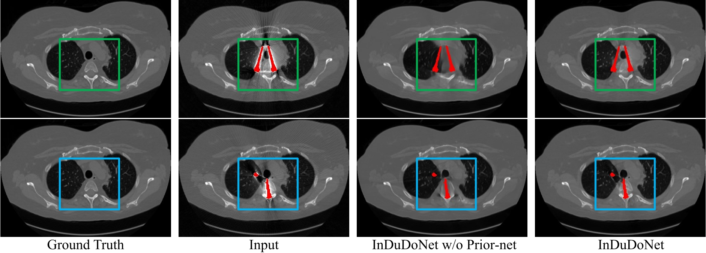
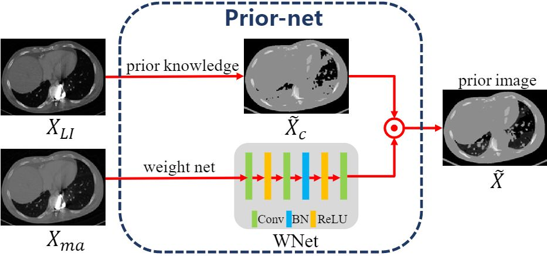
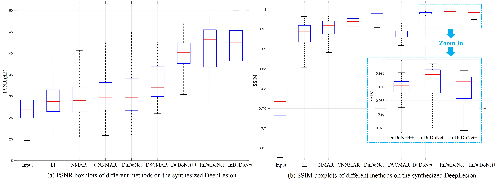
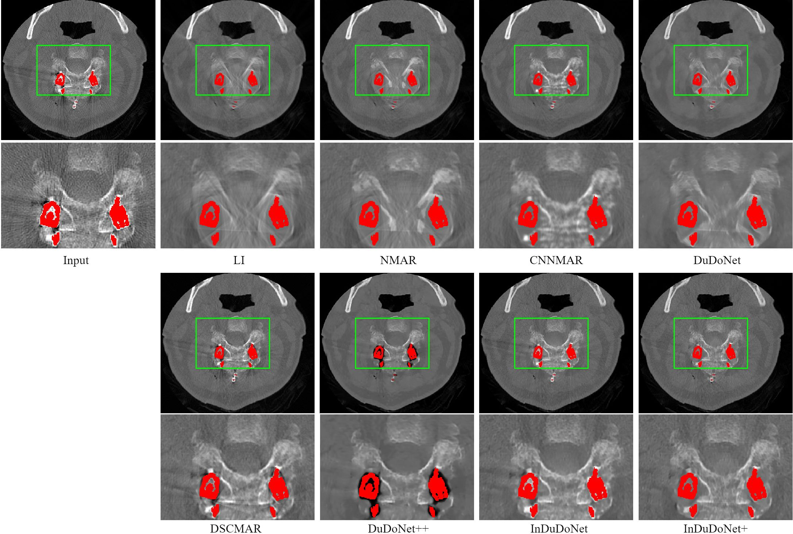

# InDuDoNet+: A Deep Unfolding Dual Domain Network for Metal Artifact Reduction in CT Images
[Hong Wang](https://hongwang01.github.io/), Yuexiang Li, Haimiao Zhang, [Deyu Meng](http://gr.xjtu.edu.cn/web/dymeng), [Yefeng Zheng](https://sites.google.com/site/yefengzheng/)

[[Google Drive]](https://drive.google.com/file/d/12NnSNk2aj-NE_MxpT-tJw2mj33cBcb4k/view?usp=sharing)[[Arxiv]](https://arxiv.org/pdf/2112.12660.pdf)

The conference paper is [InDuDoNet(MICCAI2021)](https://github.com/hongwang01/InDuDoNet)

## Abstract
During the computed tomography (CT) imaging process, metallic implants within patients always cause harmful artifacts, which adversely degrade the visual quality of reconstructed CT images and negatively affect the subsequent clinical diagnosis. For the metal artifact reduction (MAR) task, current deep learning based methods have achieved promising performance. However, most of them share two main common limitations: 1) the CT physical imaging geometry constraint is not comprehensively incorporated into deep network structures; 2) the entire framework has weak interpretability for the specific MAR task; hence, the role of every network module is difficult to be evaluated. To alleviate these issues, in the paper, we construct a novel interpretable dual domain network, termed InDuDoNet+,  into which CT imaging process is finely embedded. Concretely, we derive a joint spatial and Radon domain reconstruction model and propose an optimization algorithm with only simple operators for solving it. By unfolding the iterative steps involved in the proposed algorithm into the corresponding network modules, we easily build the InDuDoNet+ with clear interpretability. Furthermore, we analyze the CT values among different tissues, and merge the prior observations into a prior network for our InDuDoNet+, which significantly improve its generalization performance. Comprehensive experiments on synthesized data and clinical data substantiate the superiority of the proposed methods as well as the superior generalization performance beyond the current state-of-the-art (SOTA) MAR methods.

## Motivation
<div  align="center"></div>

## Knowledge-Driven Prior-net

<div  align="center"></div>


## Dependicies 
Refer to [InDuDoNet](https://github.com/hongwang01/InDuDoNet)

## Dataset & Training & Testing
Refer to [InDuDoNet](https://github.com/hongwang01/InDuDoNet) for the settings. 


## Training
```
CUDA_VISIBLE_DEVICES=0 python train.py --data_path "deeplesion/train/" --log_dir "logs" --model_dir "pretrained_model/"
```


##Testing
```
CUDA_VISIBLE_DEVICES=0 python test_deeplesion.py --data_path "deeplesion/test/" --model_dir "pretrained_model/" --save_path "results/deeplesion/" 
```


## Experiments on Synthesized Data
<div  align="center"></div>


## Experiments on SpineWeb
<div  align="center"></div>


## Citations

```
@article{wang2023indudonet+,
  title={InDuDoNet+: A deep unfolding dual domain network for metal artifact reduction in CT images},
  author={Wang, Hong and Li, Yuexiang and Zhang, Haimiao and Meng, Deyu and Zheng, Yefeng},
  journal={Medical Image Analysis},
  volume={85},
  pages={102729},
  year={2023}
}
```

## Contact
If you have any question, please feel free to concat Hong Wang (Email: hongwang9209@hotmail.com)
